# Java 经典风格 UI

内置界面的尺寸与状态以 Minecraft Java 1.20.1 的经典界面为参考。
标题页、世界与服务器列表、创建和删除世界、选项入口、暂停菜单共享整数像素倍率。
窗口不再沿用固定大小的桌面表单；按钮按 200×20 逻辑像素、24 像素纵向间距排版。

| 范围 | 实现 |
| --- | --- |
| 标题画面 | 274×44 石质 Luanti 标志、独立副标题、完整黄色跳动标语、语言和辅助功能像素图标、贴边版本文字 |
| 基础控件 | 原创三状态按钮纹理、正常斜面、悬停及键盘焦点白边、禁用灰字；边框随倍率缩放 |
| 字体 | 可变字宽的原创像素英文字体、整数栅格、按倍率缩放的阴影，保留缺失字形后备字体 |
| 单人游戏 | 暗色列表区域、世界图标、双行信息、灰色选中边框、150/72 像素操作按钮，保留游戏筛选及模组配置 |
| 多人游戏 | 等高服务器列表、搜索、独立连接页；保留收藏、注册、协议检查及云端连接处理 |
| 创建与删除世界 | 黑色输入框、清楚分开的标签、滚动地图生成器选项、居中的确认按钮 |
| 设置 | 两列 150 像素分类入口，连接现有完整设置页 |
| 游戏内 | 暂停菜单采用相同尺寸规则与按钮纹理；保留默认背包凹槽、快捷栏与生命/气泡像素图标 |
| 社区 | 云同步、好友、组队、私聊和内容管理仍可访问；配对说明正确换行 |

图案与字体由 `util/generate_classic_ui.py` 原创生成，使用 CC0 授权；没有打包 Minecraft 的图像或字体。
重建需要 Python、Pillow、fontTools、NumPy 和 optipng，运行 `python3 util/generate_classic_ui.py`。

背景采用完整体素体积的透视射线遍历，包含全部可见侧面和前景遮挡，相机没有横滚。
背景按窗口比例等比覆盖，水平漂移限制在窗口宽度的 2% 内；资源路径经过规范化，
兼容运行目录包含 `bin/..` 的情况。非标题页面使用按界面倍率平铺的泥土纹理。

这仍然是 Luanti 的经典风格界面。品牌、背景场景、社区入口与部分设置项目保留 Luanti 内容；
中文使用原有后备字体。游戏和模组指定的背包布局、HUD 数量、字体、背景图片及颜色继续生效，
因此不声称所有界面都与 Minecraft 逐像素相同。

## 实机截图

以下截图来自本次修改后的 Linux / OpenGL 3 / 软件渲染 / 简体中文实际客户端。
验证使用独立测试世界、无账号的用户目录，并关闭外部服务请求。

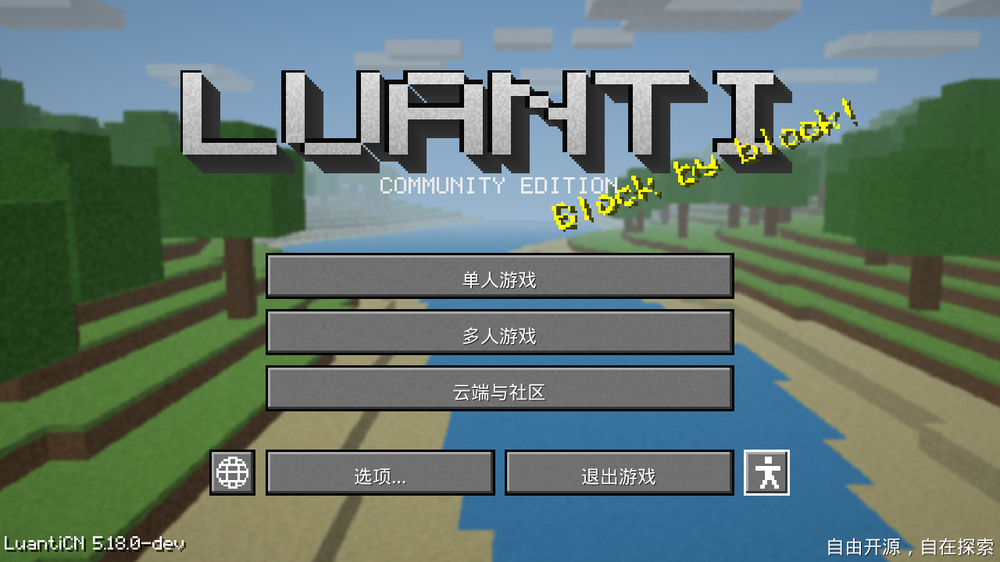
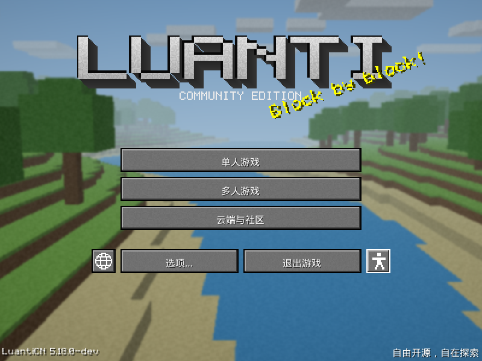
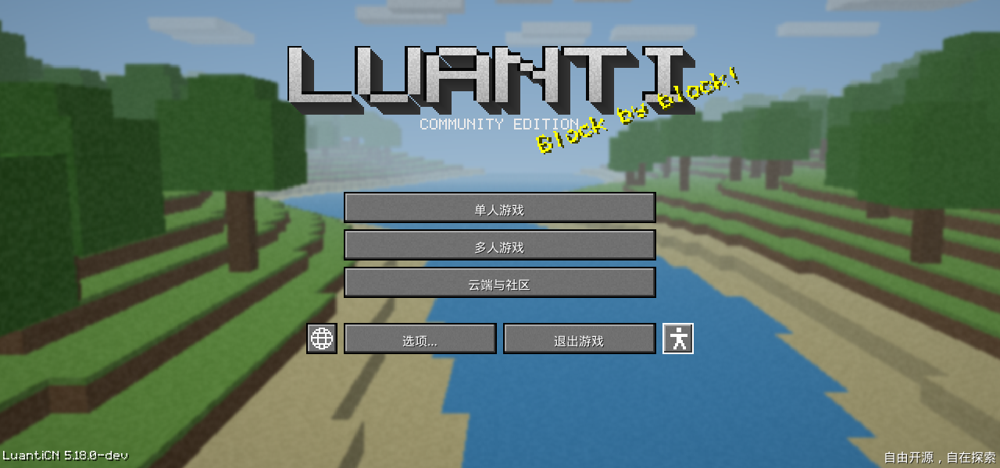
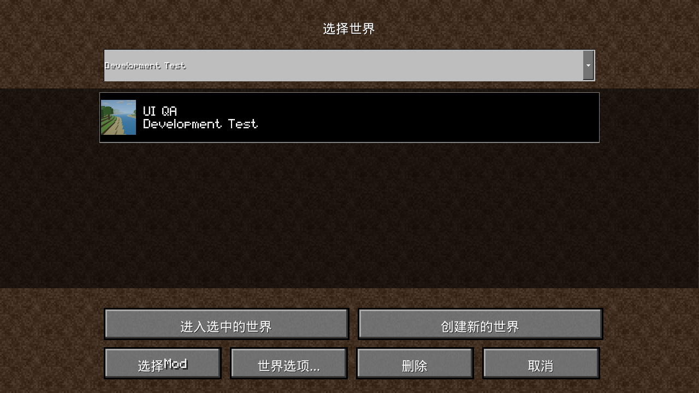
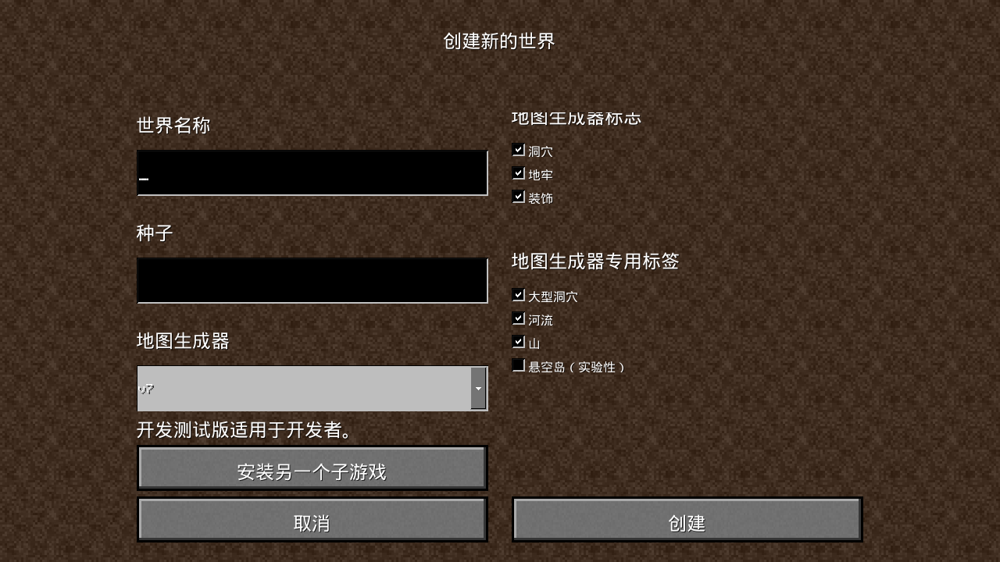
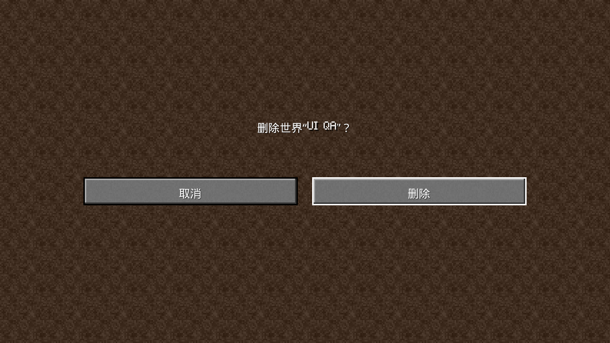

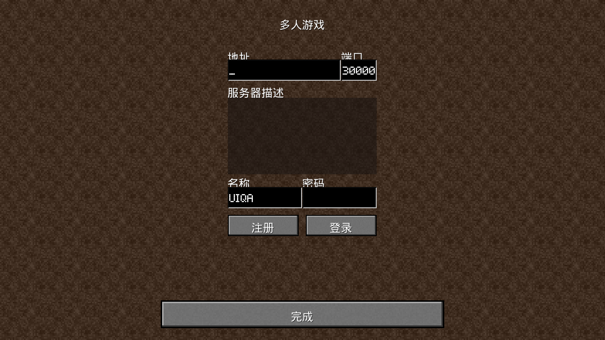
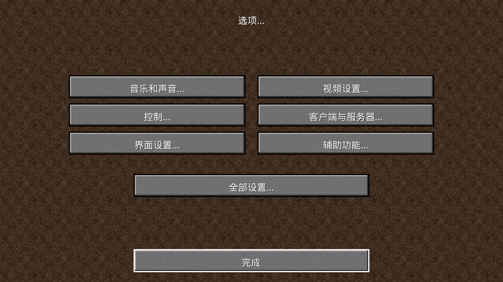
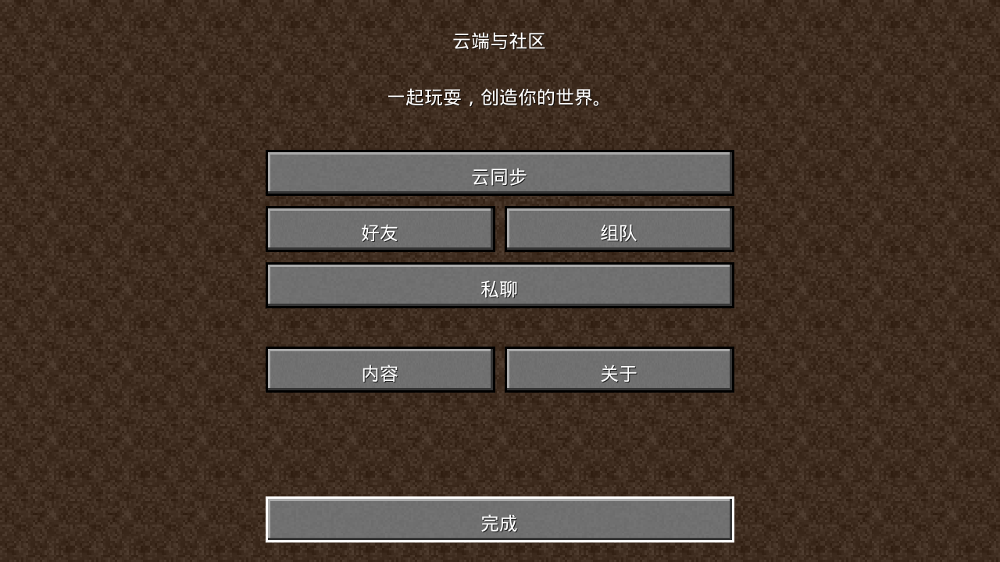
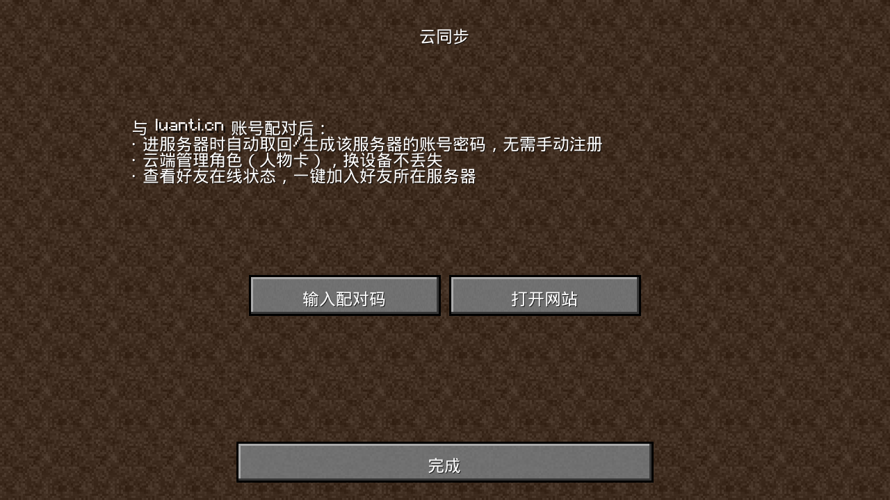
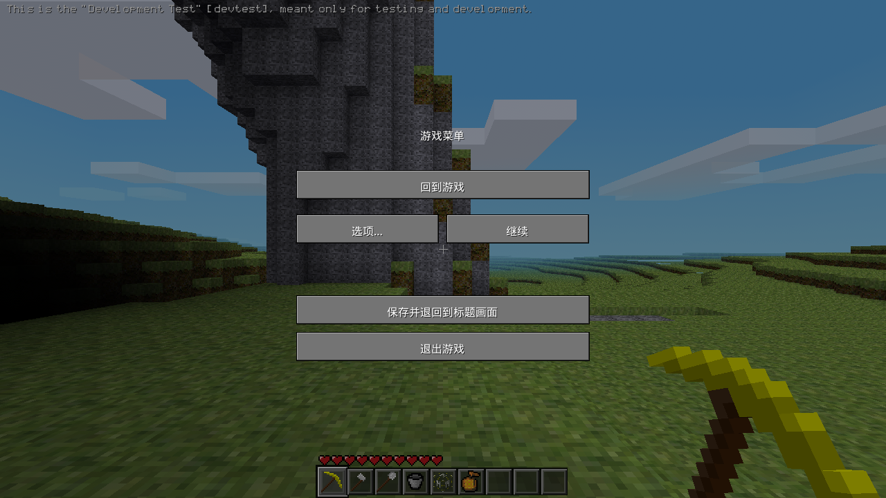
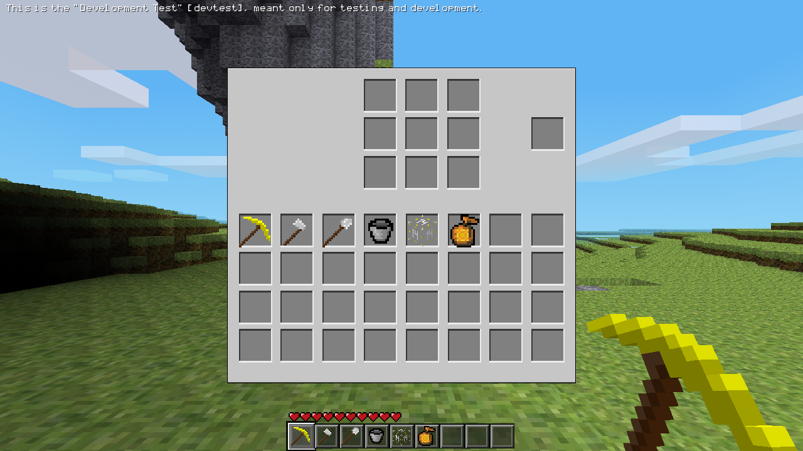

## 验证

- CMake / Ninja 客户端构建通过：`RUN_IN_PLACE=ON`、`ENABLE_SOUND=ON`、`BUILD_UNITTESTS=ON`。
- `./bin/luanti --run-unittests`：50 个模块、351 项检查通过；Catch2 9 个用例通过。
- `busted builtin --lua=luajit`：159 项通过，包括 12 项菜单回归规格。
- `luacheck builtin`：修改文件无警告，另有 5 条既有云端代码警告。
- 18 个生成资源重建后 SHA-256 一致，`git diff --check` 通过。
- 实机检查 1280×720、800×600、1280×600 的标题布局、背景覆盖与窗口切换。
- 世界选择、创建和删除确认、单人游戏启动、暂停与背包、设置入口、多人与社区页面的返回流程已检查。

真实远程服务器登录、已配对云账号以及其他平台未执行端到端验证。
